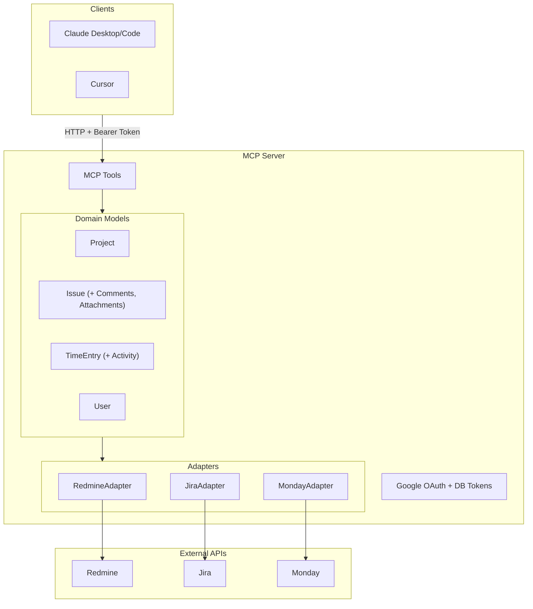

# salut

Multi-provider MCP server for project management and time tracking. Connects AI assistants (Claude Desktop/Code, Cursor, etc.) to Redmine, Jira Cloud, Monday.com, and Trello with OAuth2.

## Supported Providers

| Provider | Projects | Project Write | Issues | Issue Write | Time Read | Time Write | Attachments | Attachment Write | Activities | Statuses |
|----------|:--------:|:-------------:|:------:|:-----------:|:---------:|:----------:|:-----------:|:----------------:|:----------:|:--------:|
| Redmine  | x | | x | x | x | x | x | | required for log_time | x |
| Jira Cloud | x | | x | | x | x | x | | | |
| Monday.com | x | | x | | x | | x | | | |
| Trello | | | | | | | | | | |

## MCP Tools

Tools are dynamically exposed based on provider capabilities:

| Tool | Description | Redmine | Jira | Monday |
|------|-------------|:-------:|:----:|:------:|
| `list_projects` | List accessible projects | x | x | x |
| `list_issues` | Issues assigned to user | x | x | x |
| `get_issue_details` | Issue details (description, comments, attachments) | x | x | x |
| `update_issue` | Update issue status | x | | |
| `list_time_entries` | Time entries for a date range | x | x | x |
| `get_attachment` | Download an attachment | x | x | x |
| `log_time` | Log time on an issue | x | x | |
| `update_time_entry` | Update a time entry | x | x | |
| `delete_time_entry` | Delete a time entry | x | x | |
| `list_activities` | Time tracking activity types | x | | |

## MCP Resources

Resources provide reference data for tools:

| Resource | Description | Redmine | Jira | Monday |
|----------|-------------|:-------:|:----:|:------:|
| `provider://statuses` | Available issue statuses (for `update_issue`, `list_issues`) | x | | |
| `provider://activities` | Time tracking activity types (for `log_time`) | x | | |

## Quick Start

### Claude Code Configuration

Create `.mcp.json` in your project or `~/.claude/.mcp.json`:

```json
{
  "mcpServers": {
    "timetracking": {
      "type": "http",
      "url": "https://your-server.com/mcp"
    }
  }
}
```

### Authentication

1. First request → Google Sign-In redirect
2. Choose provider (Redmine/Jira/Monday)
3. Enter credentials (URL + API key)
4. Token stored in database with encrypted credentials

## Architecture



### Principles

- **Database-backed tokens**: Credentials encrypted and stored in DB for instant revocation
- **Dynamic capabilities**: Tools filtered by provider (e.g., Monday doesn't have `log_time`)

## Installation

### Docker (Production)

```bash
git clone https://github.com/guiziweb/mcp-project-management.git
cd mcp-project-management
cp .env.example .env.local
# Edit .env.local

make deploy
```

### Local (Development)

```bash
composer install
cp .env.example .env.local
# Edit .env.local

symfony server:start --port=8080
```

## Configuration

### Environment Variables

```bash
# Required
APP_URL=https://your-server.com
ENCRYPTION_KEY=base64-encoded-sodium-key
GOOGLE_CLIENT_ID=xxx.apps.googleusercontent.com
GOOGLE_CLIENT_SECRET=xxx

# Access control (at least one required)
ALLOWED_EMAIL_DOMAINS=company.com
ALLOWED_EMAILS=user@example.com
```

### Google OAuth Setup

1. [Google Cloud Console](https://console.cloud.google.com/) → New project
2. APIs & Services → OAuth consent screen → External
3. Credentials → OAuth 2.0 Client ID → Web application
4. Redirect URI: `https://your-server.com/oauth/google-callback`

## Commands

```bash
make dev              # Install dev dependencies
make static-analysis  # PHPStan + CS check + lints
make cs-fix           # Fix code style
make test             # Run tests
make deploy           # Docker rebuild
```

### Bot Token (automation)

```bash
# Create bot token (requires existing organization)
php bin/console app:create-bot \
  --organization=my-org-slug \
  --email=bot@company.com \
  --api-key=xxx

# For Jira, add provider email
php bin/console app:create-bot \
  --organization=my-jira-org \
  --email=bot@company.com \
  --api-key=xxx \
  --provider-email=jira-user@company.com
```

## Project Structure

```
src/
├── Domain/
│   ├── Model/          # Issue, Project, TimeEntry, User, etc.
│   ├── Port/           # Interfaces (IssuePort, TimeEntryReadPort, etc.)
│   └── Service/        # Domain services
├── Infrastructure/
│   ├── Adapter/        # AdapterFactory, CurrentUserService
│   ├── Redmine/        # RedmineAdapter, RedmineClient, Normalizers
│   ├── Jira/           # JiraAdapter, JiraClient, Normalizers
│   ├── Monday/         # MondayAdapter, MondayClient, Normalizers
│   ├── Security/       # JWT, OAuth, Encryption
│   └── Web/            # Forms, Components
├── Tools/              # MCP Tools (ListIssuesTool, LogTimeTool, etc.)
└── Controller/         # McpController, OAuthController
```

## License

MIT